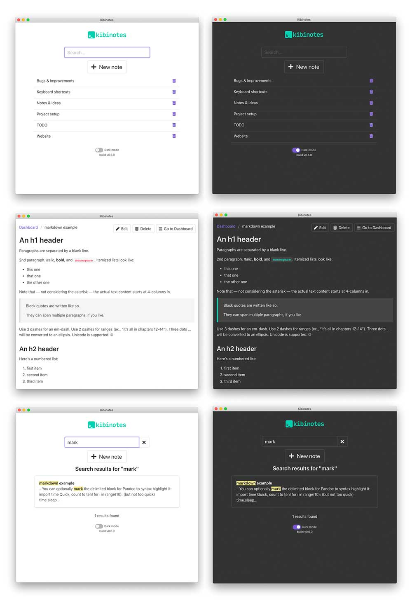

#  Kibinotes

> Minimalistic notes application with instant search



# Development

- Use `npm install` to init dependencies
- `npm electron:serve` to run development mode

## How to fix better-sqlite3 error

To rebuild `better-sqlite3` with used version of electron run: 
```
node_modules/.bin/electron-rebuild -f -w better-sqlite3
```
See https://github.com/JoshuaWise/better-sqlite3/issues/126#issuecomment-403943522

## How to build on MacOS without Python2

Install python2 using `pyenv` 😄
```
brew install pyenv
pyenv install 2.7.18
```

Update path to python in `node_modules/dmg-builder/out/dmg.js` on line 388.

```js
...await (0, _builderUtil().exec)("/Users/username/.pyenv/versions/2.7.18/bin/python", [path.join((0, _dmgUti...
```

⚠️ Note: The path must be absolute or it won't work.

## Useful documentation links

- https://buefy.org/documentation
- https://bulma.io/documentation/
- https://github.com/JoshuaWise/better-sqlite3/blob/master/docs/api.md
- https://www.sqlite.org/docs.html
- https://www.electron.build/
- https://vuejs.org/v2/api/

## License

GNU GPLv3 

