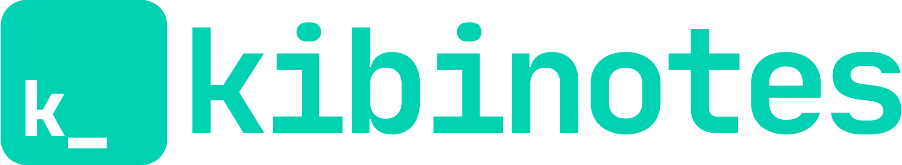

#  Kibinotes

> Minimalistic notes application with instant search

## Download

### Mac

- [Kibinotes-0.6.1.dmg](https://github.com/rostislavjadavan/kibinotes/releases/download/v0.6.1/Kibinotes-0.6.1.dmg)

### Linux

- [Kibinotes-0.6.0.AppImage](https://github.com/rostislavjadavan/kibinotes/releases/download/v0.6.0/Kibinotes-0.6.0.AppImage)

### Windows

- [Kibinotes.Setup.0.6.0.exe](https://github.com/rostislavjadavan/kibinotes/releases/download/v0.6.0/Kibinotes.Setup.0.6.0.exe)

## Keyboard Shortcuts

### Dashboard

- `Mod+N` - new note
- `Mod+1..0` - go to particular note from search results

### Note detail

- `Mod+D` - go to dashboard
- `Mod+E` - switch between edit and view mode
- `Mod+T` - edit title (when editing note)

### Mod Key

- Mac OS: `Command`
- Windows and Linux: `Ctrl`

## Notes Backup

Currenly there is no built-in solution and it is user responsibility to backup data file. Notes are stored in `data.db` file in following location:

- Mac OS: `~/Library/Application Support/kibinotes/data.db`
- Windows: `C:\Users\<you>\AppData\Local\kibinotes\data.db`
- Linux: `~/.config/kibinotes/data.db`

## License

GNU GPLv3 

## Disclaimer

THIS SOFTWARE IS PROVIDED "AS IS" AND ANY EXPRESSED OR IMPLIED WARRANTIES, INCLUDING, BUT NOT LIMITED TO, THE IMPLIED WARRANTIES OF MERCHANTABILITY AND FITNESS FOR A PARTICULAR PURPOSE ARE DISCLAIMED. IN NO EVENT SHALL THE REGENTS OR CONTRIBUTORS BE LIABLE FOR ANY DIRECT, INDIRECT, INCIDENTAL, SPECIAL, EXEMPLARY, OR CONSEQUENTIAL DAMAGES (INCLUDING, BUT NOT LIMITED TO, PROCUREMENT OF SUBSTITUTE GOODS OR SERVICES; LOSS OF USE, DATA, OR PROFITS; OR BUSINESS INTERRUPTION)
HOWEVER CAUSED AND ON ANY THEORY OF LIABILITY, WHETHER IN CONTRACT, STRICT LIABILITY, OR TORT (INCLUDING NEGLIGENCE OR OTHERWISE) ARISING IN ANY WAY OUT OF THE USE OF THIS SOFTWARE, EVEN IF ADVISED OF THE POSSIBILITY OF SUCH DAMAGE.